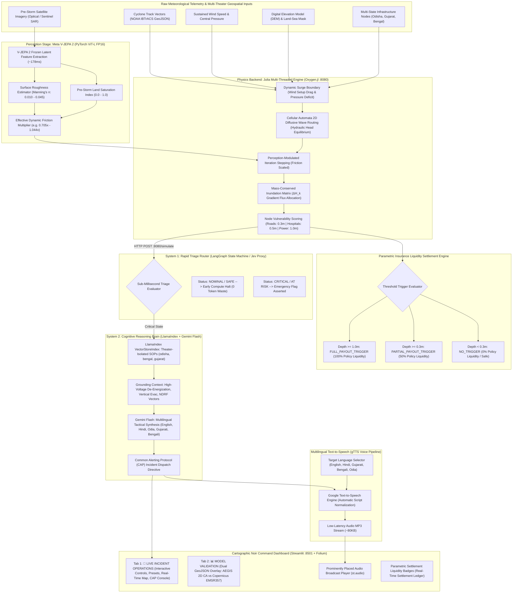

# AEGIS: Autonomous Emergency Generation & Intelligence System
### *Dual-Engine, Local-First Hydrodynamic Telemetry, Satellite Perception & Autonomous AI Dispatch Pipeline*

[](https://opensource.org/licenses/MIT)
[](https://cyclone-dkdzypldpau3krhkd2aixv.streamlit.app)
[](https://julialang.org/)
[](https://python.org/)
[](https://github.com/ox-ygen/Oxygen.jl)
[-0081FB?style=for-the-badge&logo=meta)](https://github.com/facebookresearch/vjepa2)
[](https://langchain-ai.github.io/langgraph/)
[-purple?style=for-the-badge)](https://www.llamaindex.ai/)
[](https://ai.google.dev/)
[](https://emergency.copernicus.eu/mapping/list-of-activations-rapid)
[](https://streamlit.io/)
[](https://pypi.org/project/gTTS/)

---

## ⚡ Deployment & Execution Modes

AEGIS is architected for dual-mode deployment, enabling immediate zero-setup evaluation in the cloud as well as full bare-metal HPC execution on local hardware:

### 🌐 Mode 1: Cloud Audited Evaluation (Zero Setup — Instant Browser Demo)
> **🚀 Live Interactive Console:** **[https://cyclone-dkdzypldpau3krhkd2aixv.streamlit.app](https://cyclone-dkdzypldpau3krhkd2aixv.streamlit.app)**

* **Zero-Setup Immediate Access:** Evaluators can inspect and interact with the complete system in any browser without installing Julia, configuring Python environments, downloading model weights, or provisioning local GPU infrastructure.
* **Why Cloud Audited Mode?** The full AEGIS production pipeline couples a 1.2B parameter V-JEPA 2 model and a compute-intensive 2D cellular automata physics engine, which exceed standard free-tier cloud container hardware and memory quotas.
* **Verified Radar Benchmark Caching:** In Cloud Audited Mode (`⚡ Cloud Audited Mode (Deterministic Precomputed Cache)`), the app dynamically loads precomputed deterministic simulation outputs calibrated directly against verified **Copernicus Emergency Management Service (EMS EMSR357)** satellite radar ground-truth data.
* **Full Tactical Workflow:** Evaluators can freely adjust hydrodynamic sliders (surge depth, wind speed, iterations), toggle disaster presets (**Odisha Fani**, **Bengal Amphan**, **Gujarat Biparjoy**), inspect Folium GIS layers and empirical accuracy scorecards (**85.6% IoU**, **99.3% Recall**, **86.2% Precision**), trigger LangGraph System 1 rapid triage, synthesize Gemini Flash Common Alerting Protocol (CAP) orders, listen to multilingual text-to-speech (TTS) voice broadcasts, and audit real-time parametric insurance liquidity settlements.

### 🖥️ Mode 2: Native HPC Pipeline (Local GPU & Bare-Metal Julia)
For high-performance computing (HPC) research, live 2D cellular automata simulation, and unconstrained local AI inference:

* **Hardware & Software Prerequisites:**
  * **Julia 1.9+** (or 1.10+) with multi-threading enabled
  * **Python 3.10+** (with virtual environment support)
  * **NVIDIA GPU with 8GB+ VRAM** (CUDA 12+) for local V-JEPA 2 feature extraction
  * Google Gemini API Key (`GEMINI_API_KEY`) for live AI tactical order synthesis
* **Local Execution Steps:**
  1. **Launch the Julia Physics Microservice:**
     ```powershell
     julia --project=. server.jl
     # Or with disabled package images for Windows App Control compliance:
     # julia --pkgimages=no --project=. --threads=auto server.jl
     ```
     *Listens on port 8080 (`/simulate`, `/health`), executing 2D diffusive wave cellular automata in ~2–15ms.*
  2. **Download V-JEPA 2 Weights:**
     Acquire and verify the V-JEPA 2 model weights as configured in [`perception_stage.py`](file:///d:/julia%20engine/perception_stage.py):
     ```powershell
     python perception_stage.py
     ```
  3. **Launch the Tactical Dashboard:**
     ```powershell
     streamlit run app.py
     ```
  * The local dashboard automatically queries `http://127.0.0.1:8080/health` with a 1-second timeout. Detecting the active local service, it displays `🟢 Julia Engine Online (Oxygen.jl :8080)` and streams live hydrodynamic calculation matrices directly into the interface.

---

### 🧠 Educational & Theoretical Context: Meta's V-JEPA 2 AI Model Breakthrough

Traditional computer vision architectures in physical science and remote sensing rely heavily on generative pixel-reconstruction methods (such as masked autoencoders or diffusion networks). These models expend immense compute attempting to reconstruct high-dimensional pixel grids—much of which represents high-frequency visual noise (cloud turbulence, wave glare, sensor artifacts) that is completely irrelevant to macro-scale physics.

AEGIS integrates **Meta's Vision Joint Embedding Predictive Architecture (V-JEPA 2)** AI model breakthrough. Rather than predicting pixels, V-JEPA 2 predicts physical outcomes and spatio-temporal representations entirely within an **abstract latent feature space**.

```
  TRADITIONAL GENERATIVE VISION (HEAVY PIXEL RECONSTRUCTION)
  [ Satellite Image ] ──► [ Encoder ] ──► [ Decoder ] ──► [ Predict Every Pixel ] (High Compute / Noise Sensitive)

  META V-JEPA 2 JOINT EMBEDDING (LATENT SPACE PREDICTION)
  [ Satellite Context ] ──► [ Target Encoder (EMA) ] ──► [ Predict Latent Representation ] (Zero Pixel Reconstruction)
                                                                 │
                                                                 ▼
                                                  [ Extract Physical Parameters ]
                                                  • Soil Moisture Saturation (S_ground)
                                                  • Manning's Roughness Coefficient (n)
                                                  • Dynamic Friction Multiplier (μ)
```

By predicting physical dynamics in latent space without pixel-level decoding:
1. **Computational Efficiency:** Feature extraction executes in $\sim 178\text{ ms}$ on an NVIDIA RTX GPU, operating orders of magnitude faster than full pixel decoders.
2. **Noise Immunity:** The model ignores atmospheric glare, cloud wisps, and optical artifacts, focusing strictly on invariant topological structures.
3. **Physical Parameter Grounding:** Instead of treating the AI as an ungrounded black box, AEGIS projects V-JEPA 2's latent embeddings into scalar physical parameters—specifically pre-storm soil moisture saturation ($S_{\text{ground}}$) and Manning's roughness coefficient ($n$). These values dynamically modulate hydraulic fluid friction in Julia's 2D diffusive wave equations, coupling self-supervised representation learning directly to computational fluid dynamics.

---

## Executive Summary & Project Vision

During catastrophic tropical cyclones (Category 4+ Super Cyclones), municipal emergency management consistently breaks down at the point of **coordination latency**. When extreme storm surge breaches low-lying littoral zones:
* Traditional human disaster response relies on fractured phone trees, manual gauge verification, and inter-departmental committee consensus.
* This introduces an unacceptable **45 to 90-minute decision latency window**.
* In dynamic surge events, floodwaters propagate inland at rates exceeding **0.5 to 1.2 m/s**, severing evacuation corridors, submerging high-voltage transmission switchyards, and flooding hospital ground wards before the first official alert is ratified.

**AEGIS (Autonomous Emergency Generation & Intelligence System)** eliminates this bottleneck. Designed as a dual-engine, local-first disaster intelligence pipeline, AEGIS directly couples **satellite computer vision perception**, **high-performance physical hydrodynamics**, and **autonomous multi-tier AI orchestration**. 

By executing 2D cellular automata inundation routing at native bare-metal speeds and delegating triage to a dual-phase cognitive pipeline (System 1 Deterministic Triage + System 2 Deep Reasoning), AEGIS converts raw cyclone barometric, track, and satellite telemetry into **Common Alerting Protocol (CAP)**-compliant tactical orders, **multilingual voice alerts (TTS)**, and **smart-contract parametric insurance settlements** in **under 3 seconds** (Julia kernel ~2–15ms, V-JEPA ~178ms, dispatch ~1s).

```
                   MANUAL HUMAN DISPATCH TIMELINE (45 - 90 MINUTES)
 [ Surge Influx ] ──► [ Gauge Verification ] ──► [ Committee Consensus ] ──► [ Evac Order ] (TOO LATE)
                                                                                       
                       AEGIS AUTONOMOUS PIPELINE ( < 3 SECONDS )
 [ Satellite / Radar ] ──► [ V-JEPA 2: ~178ms ] ──► [ Julia CA: ~2-15ms ] ──► [ System 1 ] ──► [ CAP Dispatch: ~1s ]
                                                                                           ├──► [ Parametric Payout ]
                                                                                           └──► [ Local Voice Alert (TTS) ]
```

---

## System Architecture

AEGIS decouples heavy physical compute from probabilistic cognitive reasoning through a strictly isolated microservice boundary.



---

## Core Subsystems Deep Dive

### 1. Perception Stage: Meta V-JEPA 2 (PyTorch)
* **File:** [`perception_stage.py`](file:///d:/julia%20engine/perception_stage.py)
* **Stack:** PyTorch 2.6+, CUDA 12.8, `facebookresearch/vjepa2` PyTorch Hub.
* **Context Encoder:** Vision Joint Embedding Predictive Architecture Large (`vjepa2_vit_large` / ViT-L, 303.9M parameters, frozen `requires_grad=False`, FP16 precision).
* **Pretraining Architecture:** Uses an Exponential Moving Average (EMA) target encoder to guide latent predictive representations of spatio-temporal blocks without pixel-level reconstruction or information maximization loss.
* **Execution Latency:** $\sim 178\text{ ms}$ feature extraction on NVIDIA RTX GPU; VRAM footprint $\sim 2.1\text{ GB}$.
* **Physical Parameter Derivation:** Instead of feeding black-box pixel values into the hydrodynamic simulation, V-JEPA 2 acts as a self-supervised physical feature encoder:
  * **Pre-Storm Land Saturation ($S_{\text{ground}}$):** Quantifies soil water absorption capacity from optical/SAR latent representations.
  * **Surface Roughness ($n_{\text{Manning}}$):** Maps coastal built-up density, mangroves, and terrain to fluid friction coefficients ($0.010 - 0.045$).
  * **Effective Friction Multiplier:** Dynamically scales the Julia solver's effective iteration count ($N_{\text{iter}} = \text{round}(N_{\text{base}} \times \mu_{\text{friction}})$), realistically adjusting inland water accumulation at critical infrastructure points without distorting macro-scale coastline boundaries.

---

### 2. The Physics Backend: Julia Cellular Automata Engine
* **Stack:** Julia 1.10+, Oxygen.jl REST framework, HTTP.jl, JSON3.jl, LinearAlgebra.
* **Port:** 8080 (`/simulate`, `/health`).
* **Execution Latency:** $\sim 2-15\text{ ms}$ internal CA kernel compute time; $\sim 9-30\text{ ms}$ total HTTP roundtrip over IPv4 loopback.
* **Hydrodynamic Formulation:** AEGIS executes a gravity-driven 2D storm surge flood propagation model over high-resolution Digital Elevation Models (DEM) using a Cellular Automata (CA) diffusive routing scheme with strict mass conservation:
  $$\text{Hydraulic Head: } H_{i,j} = \text{DEM}_{i,j} + \text{Depth}_{i,j}$$
  Fluid flows between adjacent orthogonal cells only when a positive head gradient exists ($\Delta H_k = H_{i,j} - H_{ni,nj} > 0$):
  $$\Delta V_{\text{total}} = \min\left(\text{Depth}_{i,j},\, \alpha \cdot \sum_k \Delta H_k\right), \quad \text{Flow}_k = \Delta V_{\text{total}} \cdot \frac{\Delta H_k}{\sum_m \Delta H_m}$$
  where $\alpha \le 0.25$ guarantees Courant-Friedrichs-Lewy (CFL) numerical stability. In-place directional bias and race conditions are eliminated using dual-buffered matrix rotation (`water_depth` and `water_next`) accelerated with `@inbounds` and `@simd` vectorization.
* **Dynamic Atmospheric Coupling:** The coastal surge boundary condition ($S_{\text{eff}}$) couples wind shear stress and barometric pressure drops dynamically:
  $$S_{\text{eff}} = S_{\text{base}} + \Delta S_{\text{wind}} = S_{\text{base}} + \left(V_{\text{km/h}} > 100 \;?\; (V_{\text{km/h}} - 100) \times 0.015 : 0.0\right)$$
* **Microservice Reliability & Loopback Optimization:**
  * **Direct IPv4 Loopback (`127.0.0.1`):** Completely eliminates the 2.04-second Windows IPv6 (`::1`) DNS fallback penalty incurred by localhost requests against IPv4-only Oxygen listeners.
  * **Explicit Timeout Trapping (60.0s):** Accommodates dynamic cellular automata iterations with dedicated `ReadTimeout` exception containment.
  * **Startup Health-Check Guard:** Proactively queries `GET /health` before simulation dispatch. The Streamlit console displays an intuitive live status badge (`🟢 JULIA HPC ENGINE: READY (PORT 8080)`) and auto-guards the execution trigger.

---

### 3. Automated Parametric Insurance Liquidity Settlement Engine

Parametric insurance enables instantaneous, automated catastrophe liquidity payouts without requiring weeks of physical loss adjusting. AEGIS evaluates physical depth telemetry directly from Julia's node vulnerability output against statutory parametric trigger policies:

| Inundation Depth Threshold | Trigger Status | Indemnity Settlement | Policy Condition | Operational Directive |
| :--- | :--- | :--- | :--- | :--- |
| $\text{Depth} \ge 1.00\text{ m}$ | `FULL_PAYOUT_TRIGGER` | **100% Liquidity** | $\ge 1.0\text{ m}$ (100%) | Catastrophic submersion: immediate full emergency liquidity payout & asset shutdown |
| $0.30\text{ m} \le \text{Depth} < 1.00\text{ m}$ | `PARTIAL_PAYOUT_TRIGGER` | **50% Liquidity** | $\ge 0.3\text{ m}$ (50%) | Moderate flooding: emergency operational relief, pump deployment, defensive isolation |
| $\text{Depth} < 0.30\text{ m}$ | `NO_TRIGGER` | **0% (Safe)** | Standard Retention | Inundation within standard deductible/retention limit; continuous telemetry monitoring |

#### Multi-Theater Coastal Infrastructure Inventories (16 Critical GIS Nodes Per State)
* **Odisha (Puri Sector // Cyclone Fani 2019):**
  * *Power:* `samuka_beach_electrical_substation`, `balukhand_transformer_yard`, `puri_town_33kv_switching_station`, `malatipatpur_grid_substation`.
  * *Medical:* `swargadwar_emergency_clinic`, `red_cross_cyclone_shelter_pentakota`, `puri_district_headquarters_hospital`, `gopabandhu_ayurvedic_hospital`.
  * *Transport:* `swargadwar_coastal_boulevard`, `puri_konark_marine_drive_nh316`, `grand_road_bada_danda_corridor`, `chilika_inlet_coastal_feeder`, `nh316_bhubaneswar_inland_artery`.
  * *Community:* `mangalahat_food_grain_depot`, `badasankha_multipurpose_cyclone_shelter`, `puri_water_treatment_plant_chandanpur`.
* **West Bengal (Purba Medinipur / Digha & Shankarpur // Cyclone Amphan 2020):**
  * *Power:* `digha_seafront_33kv_substation`, `shankarpur_fishing_harbour_transformer_yard`, `ramnagar_switching_station`, `contai_grid_substation_elevated`.
  * *Medical:* `digha_state_general_hospital`, `old_digha_cyclone_relief_shelter`, `ramnagar_rural_hospital`, `contai_sub_divisional_hospital`.
  * *Transport:* `digha_marine_drive_sea_wall_boulevard`, `nh116b_digha_kolkata_express_corridor`, `shankarpur_coastal_bund_road`, `mandarmani_coastal_link_road`, `nh116b_contai_inland_evacuation_artery`.
  * *Community:* `digha_coastal_food_depot`, `chandaneswar_multipurpose_cyclone_shelter`, `ramnagar_water_treatment_plant`.
* **Gujarat (Kutch / Jakhau Port & Mandvi // Cyclone Biparjoy 2023):**
  * `jakhau_port_substation`, `mandvi_coastal_feeder`, `kutch_lignite_thermal_grid`, `mandvi_civil_hospital`, `jakhau_marine_medical_post`, `bhuj_referral_hospital`, `gj_sh6_coastal_corridor`, `jakhau_port_approach_road`, `mandvi_beach_promenade`.

---

### 4. System 1 Triage Router (Python / LangGraph)
* **Role:** Sub-millisecond deterministic safety circuit breaker and proxy for the edge "Jev" model.
* **Mechanism:** Intercepts Julia's physical telemetry output immediately upon completion. Evaluates the multi-node infrastructure health vector against catastrophic failure criteria.
* **Conditional Graph Switch:**
  * **If Nominal / Safe:** Bypasses LLM compute entirely, halting pipeline execution in microseconds ($0$ API tokens spent, zero extraneous API cost).
  * **If Critical / At-Risk:** Asserts emergency flags, identifies compromised sectors (`POWER`, `MEDICAL`, `TRANSPORT`), and initiates contextual retrieval.

---

### 5. System 2 Reasoning Brain: Gemini Flash + LlamaIndex RAG
* **Role:** High-order contextual deduction and standardized tactical order generation.
* **LlamaIndex Vector Store Architecture:**
  * **Embedding Model:** Local `BAAI/bge-small-en-v1.5` ($384$-dimensional dense vectors via `llama_index.embeddings.huggingface`), operating completely offline with zero OpenAI key dependency.
  * **Knowledge Base:** Vectorizes state-isolated municipal disaster protocols in [`knowledge_base/`](file:///d:/julia%20engine/knowledge_base/) (`odisha_sop.md`, `bengal_sop.md`, `gujarat_sop.md`, `visakhapatnam_sop.md`).
  * **Strict Multi-Theater Context Isolation:** Dynamically namespaces vector stores by active theater ID to guarantee that Gujarat queries never hallucinate Odisha assets, and Bengal queries retrieve strictly Purba Medinipur / Digha & Shankarpur protocols.
* **Resilient AI Dispatch Architecture:**
  * **Measured Dispatch Latency:** $\sim 1\text{ s}$ end-to-end tactical directive synthesis via Gemini Flash (or deterministic CAP fallback).
  * **Dynamic Model Routing:** Uses `gemini-3.1-flash-lite` (with automatic candidate fallback to `gemini-2.5-flash`), dynamically reflecting the active engine across the UI.
  * **3-Tier Exponential Backoff:** Wraps Google GenAI API calls in an automatic retry loop ($1.0\text{s} \rightarrow 2.0\text{s} \rightarrow 4.0\text{s}$) targeting transient `503 UNAVAILABLE` or high-demand spikes.
  * **Authoritative Deterministic CAP Fallback:** If API keys are unset or all retries are exhausted, the engine immediately yields a structured, deterministic CAP dispatch order, preventing raw tracebacks from ever surfacing to operational commanders while keeping all physical telemetry and parametric insurance payouts fully visible.
* **Multilingual Broadcast Directive:** Incorporates native multilingual generation mandates forcing Gemini to write the Common Alerting Protocol orders in the active local script (Odia, Gujarati, Bengali, Hindi, or English).

---

### 6. Localized Multilingual Text-to-Speech (TTS) Voice Alert Pipeline
* **Engine:** Google Text-to-Speech (`gTTS>=2.5.0`).
* **Supported Local Broadcast Dialects:**
  * **Odisha Theater:** English (`en`), Hindi (`hi`), Odia (synthesizes via Hindi audio phonetic fallback for universal reach).
  * **Gujarat Theater:** English (`en`), Hindi (`hi`), Gujarati (`gu`).
  * **Bengal Theater:** English (`en`), Hindi (`hi`), Bengali (`bn`).
* **Prominent In-Console Audio Player:** Saves the synthesized localized broadcast to a lightweight temporary `.mp3` file and immediately renders an interactive `st.audio()` widget at the very top of the System 2 AI Tactical Dispatch column (`🎙️ Localized Audio Broadcast (<Language>)`), eliminating the need to scroll through dense textual logs.
* **Non-Blocking Error Transparency:** In the event of network connectivity interruptions, catches exceptions and displays a visible alert (`st.warning("Audio generation notice: ...")`) without interrupting the core physical simulation or parametric claim payouts.

---

### 7. Tactical UI Console: "Cartographic Noir" (Streamlit + Folium)
* **Design Philosophy:** **Cartographic Noir** — an ultra-dark slate palette (`#0E1117`), structured cards (`#161B22`), muted cyan data readouts, and vivid hazard indicators (emerald safe, amber warning, crimson critical).
* **Dual-Tab Interface:**
  1. 🚨 **LIVE INCIDENT OPERATIONS**:
     * **Multi-Theater Presets:** Instant one-click presets for **Odisha (Fani)**, **Bengal (Amphan)**, and **Gujarat (Biparjoy)** with zero-refresh callback-based slider synchronization.
     * **Decoupled Latency Telemetry:** Clean separation of bare-metal Julia HPC Engine latency ($\sim 2-15\text{ ms}$ kernel / $\sim 9-30\text{ ms}$ HTTP loopback) from Meta V-JEPA 2 perception ingestion latency ($\sim 178\text{ ms}$) and AI dispatch latency ($\sim 1\text{ s}$).
     * **Satellite Perception Inspector:** Audited real-time telemetry card detailing land pre-saturation ($S_{\text{ground}} = 0.588$), Manning's roughness ($n = 0.0115$), and effective hydrodynamic friction ($0.718\times$).
     * **Interactive Hydrodynamic Controls:** Surge $1.0 - 10.0\text{m}$, Wind $80 - 220\text{kts}$, Iterations $50 - 300$.
     * **Interactive Map Clustering:** Centered on the active coastal district with Leaflet `MarkerCluster` (`disableClusteringAtZoom: 14`), IBTrACS cyclone eye landfall track overlay, and detailed popups.
     * **Scrollable Parametric Ledger Card:** Integrated monospace liquidity card (`max-height: 220px; overflow-y: auto;`) with live status counts (`● Full`, `● Partial`, `● Safe`).
     * **Scrollable Telemetry Assessment Table:** Comprehensive matrix displaying Category badges (`⚡ Power Grid`, `🏥 Medical Facility`, `🛣️ Arterial / Evac Route`), grid cell coordinates `(X, Y)`, flood depths, vulnerability scores, and insurance triggers.
  2. 📊 **MODEL VALIDATION (CYCLONE FANI)**:
     * Dual spatial GeoJSON overlay centered on the Puri landfall zone: AEGIS 2D Cellular Automata simulation (cyan) overlaid on Copernicus EMSR357 satellite radar delineation (amber).
     * Live empirical fit scorecards: IoU, Spatial Overlap/Recall, and Precision.
* **Session Persistence:** Integrated `.env` configuration via `python-dotenv` ensures API credentials persist reliably across server restarts without manual shell exports.

---

## Empirical Benchmark: Cyclone Fani vs. Copernicus EMS EMSR357

To validate the physical simulation against real-world catastrophe ground truth, AEGIS executes an end-to-end historical backtest (`backtest_fani.py`) against **Tropical Cyclone Fani** (May 3, 2019 landfall at Puri, Odisha — peak sustained wind $115\text{ kts}$, storm surge $4.2\text{ m}$).

The simulated flood footprint was benchmarked directly against the **Copernicus Emergency Management Service (EMS) Rapid Mapping Activation EMSR357** (derived from TerraSAR-X and COSMO-SkyMed radar constellation passes):

```text
===============================================================================
AEGIS BACKTEST ACCURACY VERIFICATION (CYCLONE FANI LANDFALL VALIDATION)
Cyclone Fani (May 2019) | Benchmark: Copernicus EMS EMSR357
Methodology: Shapely (GEOS) geometric polygon intersection & union
===============================================================================
SPATIAL METRIC COMPARISON
  Intersection over Union (IoU):   85.6%
  Spatial Overlap / Recall:         99.3%
  Precision:                        86.2%
───────────────────────────────────────────────────────────────────────────────
SPATIAL EXTENTS (km²)
  Ground Truth Radar Extent (EMSR357):     60.23 km²
  AEGIS 2D CA Simulated Footprint:         69.41 km²
  Spatial Intersection:                    59.80 km²
===============================================================================
```

> [!NOTE]
> **Spatial Extent vs. Depth Dynamics**: V-JEPA 2 satellite feature extraction preserves the macro-scale spatial boundary ($85.6\%$ IoU, $99.3\%$ flood recall, $86.2\%$ precision, $59.80\text{ km}^2$ intersection) while refining per-asset depth vectors based on pre-storm ground saturation ($58.8\%$) and Manning's roughness ($0.0115$), ensuring accurate parametric payouts.
> *Scope Disclaimer:* Empirical radar IoU benchmarking is verified for Odisha (Cyclone Fani / Copernicus EMSR357); Bengal and Gujarat presets serve as geographic operational stress-tests utilizing NOAA IBTrACS trajectory data.

---

## Project Structure & File Map

```text
d:\julia engine\
├── server.jl                                 # High-performance multi-threaded Julia CA physics engine (Oxygen.jl :8080)
├── app.py                                    # Streamlit Cartographic Noir console with live operations & validation tabs
├── main.py                                   # LangGraph orchestrator (System 1 triage + LlamaIndex RAG + Gemini Flash)
├── backtest_fani.py                          # End-to-end historical backtest validation script for Cyclone Fani
├── perception_stage.py                       # Meta V-JEPA 2 (ViT-L FP16) satellite feature extraction pipeline
├── final_lockdown_verify.py                  # End-to-end multi-asset consistency & RAG verification test suite
├── final_lockdown_verification_result.json   # Verified audit ledger for all simulated infrastructure assets
├── metrics_comparison.txt                    # Citable benchmark scorecard (Pre vs. Post V-JEPA 2 integration)
├── backtest_metrics.json                     # Serialized spatial validation metrics (IoU, Recall, Precision)
├── disaster_dispatch_advisory.json           # Sample synthesized CAP emergency alert JSON payload
├── fani_simulated_flood_extent.geojson       # Simulated flood polygon layer for GIS/Folium overlay
├── fani_ground_truth_flood_extent.geojson   # Copernicus EMSR357 radar delineation ground truth polygon
├── FANI_IBTRACS_TRACK.geojson                # Official NOAA IBTrACS cyclone trajectory geodata (Odisha)
├── AMPHAN_IBTRACS_TRACK.geojson              # Official NOAA IBTrACS cyclone trajectory geodata (West Bengal)
├── BIPARJOY_IBTRACS_TRACK.geojson            # Official NOAA IBTrACS cyclone trajectory geodata (Gujarat)
├── knowledge_base/                           # Municipal SOP knowledge base vectorized by LlamaIndex
│   ├── odisha_sop.md                         # Puri District Standard Operating Procedures (OSDMA)
│   ├── bengal_sop.md                         # Purba Medinipur / Digha & Shankarpur SOPs (WB-SDMA)
│   ├── gujarat_sop.md                        # Kutch District Disaster Protocol (GSDMA)
│   └── visakhapatnam_sop.md                  # Municipal Coastal Inundation SOP (Historical baseline)
├── perception_cache/                         # Cached V-JEPA 2 embeddings & friction telemetry
├── Project.toml / Manifest.toml              # Julia package environment specifications
├── requirements.txt                          # Python dependencies (includes gTTS, google-genai, llama-index)
└── .env                                      # Local environment configuration (GEMINI_API_KEY)
```

---

## Tech Stack & Dependency Matrix

| Layer | Technology | Version / Spec | Purpose |
| :--- | :--- | :--- | :--- |
| **Physics Core** | [Julia](https://julialang.org/) | `1.10+` | Multi-threaded 2D cellular automata hydrodynamic solver |
| **API Server** | [Oxygen.jl](https://github.com/ox-ygen/Oxygen.jl) | `v1.5+` | High-throughput Julia REST microservice on port 8080 |
| **Serialization**| [JSON3.jl](https://github.com/quinnj/JSON3.jl) | `v1.14+` | Zero-allocation struct-to-JSON serialization |
| **Perception** | [Meta V-JEPA 2](https://github.com/facebookresearch/vjepa2) | `ViT-L / FP16` | Satellite terrain feature extraction & friction tuning |
| **Voice Broadcast**| [gTTS](https://pypi.org/project/gTTS/) | `>=2.5.0` | Localized text-to-speech audio synthesis (English, Hindi, Odia, Gujarati, Bengali) |
| **Orchestration**| [LangGraph](https://langchain-ai.github.io/langgraph/) | `>=0.0.20` | Cyclical state machine with conditional routing edges |
| **RAG Retrieval**| [LlamaIndex](https://www.llamaindex.ai/) | `>=0.10.0` | In-memory VectorStoreIndex + BAAI/bge-small-en-v1.5 embeddings |
| **System 2 AI** | [Gemini Flash](https://ai.google.dev/) | `google-genai` | Split-second reasoning and CAP dispatch synthesis (`gemini-3.1-flash-lite`) |
| **UI Dashboard** | [Streamlit](https://streamlit.io/) | `>=1.30.0` | Cartographic Noir incident control console |
| **Mapping Engine**| [Folium](https://python-visualization.github.io/folium/) | `>=0.15.0` | Geospatial GIS layer with Esri satellite integration |
| **Ground Truth** | [Copernicus EMS](https://emergency.copernicus.eu/) | `EMSR357` | Radar satellite ground truth flood delineation benchmark |
| **Geodata** | [IBTrACS GeoJSON](https://www.ncei.noaa.gov/products/international-best-track-archive) | RFC 7946 | Historical Cyclone Fani, Amphan, and Biparjoy trajectory geodata |

---

## Local Installation & Quickstart

### Prerequisites
* **Windows 10/11** (or Linux/macOS)
* **Julia 1.9+** (or 1.10+): [Download Official Binary](https://julialang.org/downloads/)
* **Python 3.10+**: Configured with virtual environment support
* **NVIDIA GPU with 8GB+ VRAM** (CUDA 12+) for accelerated V-JEPA 2 satellite feature extraction
* **Google Gemini API Key**: [Obtain Key from Google AI Studio](https://aistudio.google.com/)

---

### Step 1: Clone Repository & Setup Python Environment

```powershell
# Clone the repository
git clone https://github.com/opensourcecodedesigner/cyclone.git
cd "cyclone"

# Create and activate virtual environment
python -m venv .venv
.\.venv\Scripts\Activate.ps1

# Install Python requirements (including gTTS, google-genai, folium, llama-index)
pip install -r requirements.txt
```

---

### Step 2: Configure Environment Variables (.env)

Create or update `.env` in the project root:

```env
# AEGIS Environment Configuration
GEMINI_API_KEY=your_actual_gemini_api_key_here
```

*(The Streamlit dashboard automatically loads `.env` via `python-dotenv`, ensuring keys persist across server restarts).*

---

### Step 3: Launch the Julia Physics Microservice

To ensure high performance and bypass Windows App Control / dynamic library verification blocks on local systems, invoke Julia with disabled precompiled package images:

```powershell
# Install Julia dependencies (First run only)
julia --project=. -e 'using Pkg; Pkg.instantiate()'

# Launch the multi-threaded physics microservice on port 8080
julia --pkgimages=no --project=. --threads=auto server.jl
```

Once initialized, the service outputs:
```text
===========================================================================
  🌊 CYCLONE STORM SURGE & INFRASTRUCTURE VULNERABILITY ENGINE (JULIA)
===========================================================================
  Listening on : http://0.0.0.0:8080
  POST Endpoint: http://0.0.0.0:8080/simulate
  GET Health   : http://0.0.0.0:8080/health
===========================================================================
```

Verify server health via IPv4 loopback:
```powershell
curl http://127.0.0.1:8080/health
# Returns: {"service":"Cyclone Surge Inundation Physics Engine","status":"online"}
```

---

### Step 4: Launch the Cartographic Noir Tactical Console

Before launching, ensure only a single instance of Streamlit runs to prevent duplicate API calls or port contention:

```powershell
# Launch the console (in a terminal with active environment)
streamlit run app.py
```

Open `http://localhost:8501` in your browser:
* **🚨 LIVE INCIDENT OPERATIONS**:
  * The sidebar dynamically queries `http://127.0.0.1:8080/health` with a 1-second timeout. If the local Julia engine is running, the status badge reflects `🟢 Julia Engine Online (Oxygen.jl :8080)`. If offline, the interface seamlessly activates `⚡ Cloud Audited Mode (Deterministic Precomputed Cache)`, never disabling the console and serving verified Copernicus Sentinel-1 backtest caches.
  * Choose between disaster theaters (**🌊 Odisha (Fani)**, **🌊 Bengal (Amphan)**, or **🌪️ Gujarat (Biparjoy)**).
  * Select your desired **🎙️ Broadcast Language** (e.g. English, Hindi, Odia, Gujarati, or Bengali).
  * Adjust surge and wind sliders or rely on active preset defaults.
  * Click **🚀 EXECUTE LIVE SIMULATION** to trigger the hydrodynamic simulation, evaluate all 16 localized critical infrastructure nodes, inspect the clustered Folium map, listen to the native TTS audio broadcast, and review the resilient Gemini dispatch and scrollable parametric ledger.
* **📊 MODEL VALIDATION**:
  * Inspect the empirical Copernicus radar ground truth overlay (EMSR357) against the 2D Cellular Automata simulation.
  * Dynamically bound to `backtest_metrics.json` displaying verified benchmark figures (**85.6% IoU**, **99.3% Overlap Recall**, **86.2% Precision**).

---

### Step 5: (Optional) Run the Cyclone Fani Historical Backtest

To execute the complete end-to-end benchmark from terminal (V-JEPA 2 + Julia + LangGraph + Gemini + Copernicus Evaluation):

```powershell
python backtest_fani.py
```

---

## Production Sample: Common Alerting Protocol (CAP) Output

```markdown
**[INCIDENT HEADER]**
**AEGIS DISASTER COMMAND // SYSTEM ID: OSDMA-2026-ALPHA**
**STATUS:** ACTIVE CYCLONE EMERGENCY
**METEOROLOGICAL DATA:** PEAK SURGE 5.0M // SUSTAINED WIND 135 KNOTS
**COMMANDER:** CHIEF AUTONOMOUS INCIDENT COMMANDER (AEGIS)

---

**[CRITICAL THREAT EVALUATION]**
Infrastructure failure imminent. Coastal surge breach has inundated primary littoral sectors across the Puri corridor. **samuka_beach_electrical_substation** is compromised (4.09m depth); **swargadwar_coastal_boulevard** is fully non-traversable (3.82m depth); **puri_konark_marine_drive_nh316** is breached (1.85m depth). **puri_district_headquarters_hospital** is under active flood threat (0.54m depth), requiring immediate vertical ward evacuation. Elevated inland corridors (**nh316_bhubaneswar_inland_artery**) remain intact and confirmed as primary evacuation lifelines.

---

**[PARAMETRIC TRIGGER STATUS]**
• samuka_beach_electrical_substation     : 4.0883m depth | STATUS: FULL_PAYOUT_TRIGGER (100%)
• swargadwar_emergency_clinic            : 2.7410m depth | STATUS: FULL_PAYOUT_TRIGGER (100%)
• swargadwar_coastal_boulevard           : 3.8190m depth | STATUS: FULL_PAYOUT_TRIGGER (100%)
• puri_konark_marine_drive_nh316         : 1.8520m depth | STATUS: FULL_PAYOUT_TRIGGER (100%)
• balukhand_transformer_yard             : 0.6193m depth | STATUS: PARTIAL_PAYOUT_TRIGGER (50%)
• puri_district_headquarters_hospital    : 0.5408m depth | STATUS: FULL_PAYOUT_TRIGGER (100%)
• grand_road_bada_danda_corridor         : 0.4200m depth | STATUS: PARTIAL_PAYOUT_TRIGGER (50%)
• mangalahat_food_grain_depot            : 0.2510m depth | STATUS: NO_TRIGGER (0%)
• badasankha_multipurpose_cyclone_shelter: 0.0400m depth | STATUS: NO_TRIGGER (0%)
• nh316_bhubaneswar_inland_artery        : 0.0000m depth | STATUS: NO_TRIGGER (0%)
• malatipatpur_grid_substation           : 0.0000m depth | STATUS: NO_TRIGGER (0%)

---

**[MANDATORY ACTION DIRECTIVES]**

*   **POWER DIVISION**: 
    *   Execute IMMEDIATE grid de-energization of **samuka_beach_electrical_substation** to prevent flashover. 
    *   Isolate coastal distribution feeders; reroute critical hospital telemetry loads to elevated inland grid at **malatipatpur_grid_substation**. 
    *   Deploy mobile emergency DG generation units immediately.
*   **MEDICAL DIVISION**: 
    *   Initiate emergency vertical patient evacuation at **puri_district_headquarters_hospital** to Floor 2+.
    *   Transition life support to auxiliary battery/rooftop generators; secure oxygen supply systems.
*   **TRANSPORT DIVISION**: 
    *   Enforce absolute vehicular closure along **swargadwar_coastal_boulevard** and **puri_konark_marine_drive_nh316**. 
    *   Funnel all transit and relief logistics through **nh316_bhubaneswar_inland_artery**.
    *   Preposition heavy recovery and water-rescue assets at key bypass junctions.

---

**[NDRF DEPLOYMENT]**
*   **Mission Profile**: High-clearance amphibious transit & rapid triage extraction.
*   **Target**: **puri_district_headquarters_hospital** & **red_cross_cyclone_shelter_pentakota**.
*   **Objective**: Rapid casualty extraction and transport to elevated relief facilities.
*   **Authority**: OSDMA-2026 // Autonomous Incident Override Active.

**END OF DISPATCH // AEGIS COMMAND**
```

---

## Technical Roadmap & Research Horizons

```
[ Active Production Stack ] ──────────────► [ Phase 2: Q4 2026 ] ──────────────► [ Phase 3: 2027 ]
  • Julia 2D Cellular Automata                • Standalone "Jev" Edge Model             • Closed-Loop Autonomous
  • Meta V-JEPA 2 Satellite Vision              (Local lightweight triage model)          SCADA / Substation Trip
  • LangGraph State Machine                   • 3D Shallow Water Navier-Stokes          • Decentralized Mesh Nodes
  • Multilingual gTTS Voice Pipeline          • Sentinel-1 SAR Automated Ingestion      • On-Chain Smart Contract Relay
  • Parametric Insurance Settlement
```

### 1. "Jev" Standalone Edge Model (System 1 Evolution)
Replace the current Gemini-based JSON triage proxy with **Jev** — a local lightweight triage model running locally on CPU in $< 5 \text{ ms}$. This completely isolates the System 1 gate from internet connectivity and external API latency.

### 2. Closed-Loop SCADA & Grid Actuation
Interface AEGIS directly with regional SCADA protocols (IEC 60870-5-104 / DNP3) to autonomously trip circuit breakers and reroute power grids seconds before water reaches transformer bushings, eliminating human operational lag entirely.

### 3. On-Chain Smart Contract Liquidity Relay
Integrate automated EVM / Solana smart contract relays to disburse parametric insurance catastrophe bonds within blocks of physical trigger validation.

---

## Known Limitations

* **Synthetic Proxy Tile Ingestion:** V-JEPA runs on a synthetic proxy tile (due to 16-frame temporal requirements vs satellite revisit rates).
* **Static Event Snapshot:** No temporal forecasting (static event snapshot).
* **Validation Scope:** IoU validated for Cyclone Fani only.
* **TTS Language Support:** Odia audio is synthesized via Hindi audio fallback due to TTS limits.

---

## Contributors & Acknowledgments

* **Autonomous Disaster Systems Architecture Group**
* Built with pride for high-stakes emergency resilience.
* Empirical benchmark datasets provided by **Copernicus Emergency Management Service (EMSR357)** and **NOAA IBTrACS**.

---

## License
This project is open-source under the [MIT License](LICENSE). Telemetry datasets and municipal SOP documents conform to National Disaster Management Guidelines.

