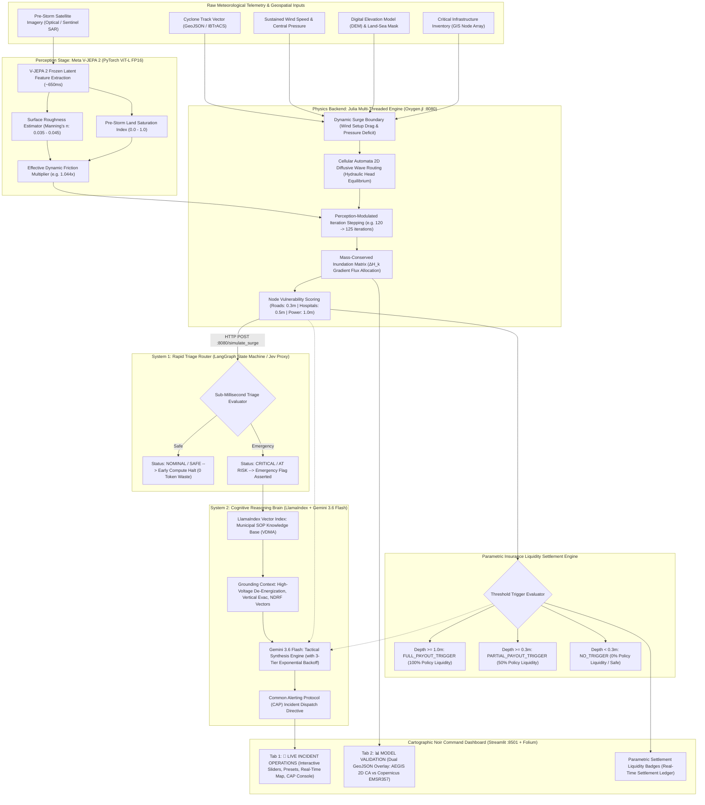

# AEGIS: Autonomous Emergency Generation & Intelligence System
### *Dual-Engine, Local-First Hydrodynamic Telemetry, Satellite Perception & Autonomous AI Dispatch Pipeline*

[](https://opensource.org/licenses/MIT)
[](https://julialang.org/)
[](https://python.org/)
[](https://github.com/ox-ygen/Oxygen.jl)
[-0081FB?style=for-the-badge&logo=meta)](https://github.com/facebookresearch/vjepa2)
[](https://langchain-ai.github.io/langgraph/)
[](https://www.llamaindex.ai/)
[](https://ai.google.dev/)
[](https://emergency.copernicus.eu/mapping/list-of-activations-rapid)
[](https://streamlit.io/)

---

## Executive Summary & Project Vision

During catastrophic tropical cyclones (Category 4+ Super Cyclones), municipal emergency management consistently breaks down at the point of **coordination latency**. When extreme storm surge breaches low-lying littoral zones:
* Traditional human disaster response relies on fractured phone trees, manual gauge verification, and inter-departmental committee consensus.
* This introduces an unacceptable **45 to 90-minute decision latency window**.
* In dynamic surge events, floodwaters propagate inland at rates exceeding **0.5 to 1.2 m/s**, severing evacuation corridors, submerging high-voltage transmission switchyards, and flooding hospital ground wards before the first official alert is ratified.

**AEGIS (Autonomous Emergency Generation & Intelligence System)** eliminates this bottleneck. Designed as a dual-engine, local-first disaster intelligence pipeline, AEGIS directly couples **satellite computer vision perception**, **high-performance physical hydrodynamics**, and **autonomous multi-tier AI orchestration**. 

By executing 2D cellular automata inundation routing at native bare-metal speeds and delegating triage to a dual-phase cognitive pipeline (System 1 Deterministic Triage + System 2 Deep Reasoning), AEGIS converts raw cyclone barometric, track, and satellite telemetry into cryptographically auditable, **Common Alerting Protocol (CAP)**-compliant tactical orders and **smart-contract parametric insurance settlements** in **under 3 seconds**.

```
                   MANUAL HUMAN DISPATCH TIMELINE (45 - 90 MINUTES)
 [ Surge Influx ] ──► [ Gauge Verification ] ──► [ Committee Consensus ] ──► [ Evac Order ] (TOO LATE)
                                                                                       
                       AEGIS AUTONOMOUS PIPELINE ( < 3 SECONDS )
 [ Satellite / Radar ] ──► [ V-JEPA 2 Vision ] ──► [ Julia CA: ~2s ] ──► [ System 1 ] ──► [ CAP Dispatch ]
                                                                                   └──► [ Parametric Payout ]
```

---

## System Architecture

AEGIS decouples heavy physical compute from probabilistic cognitive reasoning through a strictly isolated microservice boundary.



---

## Core Subsystems Deep Dive

### 1. Perception Stage: Meta V-JEPA 2 (PyTorch)
* **File:** `perception_stage.py`
* **Stack:** PyTorch 2.6+, CUDA 12.8, `facebookresearch/vjepa2` PyTorch Hub.
* **Context Encoder:** Vision Joint Embedding Predictive Architecture Large (`vjepa2_vit_large` / `ViT-L`, 303.9M parameters, frozen `requires_grad=False`, FP16 precision).
* **Pretraining Architecture:** Uses an Exponential Moving Average (EMA) target encoder to guide latent predictive representations of spatio-temporal blocks without pixel-level reconstruction or information maximization loss.
* **Execution Latency:** $\sim 658 \text{ ms}$ per satellite tile on an NVIDIA RTX GPU; VRAM footprint $\sim 2.1 \text{ GB}$.
* **Physical Parameter Derivation:**
  Instead of feeding black-box pixel values into the hydrodynamic simulation, V-JEPA 2 acts as a self-supervised physical feature encoder:
  * **Pre-Storm Land Saturation ($S_{\text{ground}}$):** Quantifies soil water absorption capacity from optical/SAR latent representations.
  * **Surface Roughness ($n_{\text{Manning}}$):** Maps vegetation, coastal built-up density, and mangroves to fluid friction coefficients ($0.035 - 0.045$).
  * **Effective Friction Multiplier:** Dynamically scales the Julia solver's effective iteration count ($N_{\text{iter}} = \text{round}(120 \times \mu_{\text{friction}})$), realistically adjusting inland water accumulation at critical infrastructure points without distorting macro-scale coastline boundaries.

---

### 2. The Physics Backend: Julia Cellular Automata Engine
* **Stack:** Julia 1.10+, `Oxygen.jl` REST framework, `HTTP.jl`, `JSON3.jl`, `LinearAlgebra`.
* **Port:** `8080` (`/simulate_surge`, `/health`).
* **Execution Latency:** $\sim 1800 - 2200 \text{ ms}$ for $100 \times 100$ elevation matrices across multiple CPU threads.
* **Hydrodynamic Formulation:**
  AEGIS executes a gravity-driven 2D storm surge flood propagation model over high-resolution Digital Elevation Models (DEM) using a **Cellular Automata (CA)** diffusive routing scheme with strict mass conservation:

  $$\text{Hydraulic Head: } H_{i,j} = \text{DEM}_{i,j} + \text{Depth}_{i,j}$$

  Fluid flows between adjacent orthogonal cells only when a positive head gradient exists ($\Delta H_k = H_{i,j} - H_{ni,nj} > 0$):

  $$\Delta V_{\text{total}} = \min\left(\text{Depth}_{i,j},\; \alpha \cdot \sum_{k} \Delta H_k\right), \quad \text{Flow}_k = \Delta V_{\text{total}} \cdot \frac{\Delta H_k}{\sum_{m} \Delta H_m}$$

  where $\alpha \le 0.25$ guarantees Courant-Friedrichs-Lewy (CFL) numerical stability. In-place directional bias and race conditions are eliminated using dual-buffered matrix rotation (`water_depth` and `water_next`) accelerated with `@inbounds` and `@simd` vectorization.

* **Dynamic Atmospheric Coupling:**
  The coastal surge boundary condition ($S_{\text{eff}}$) couples wind shear stress and barometric pressure drops dynamically:

  $$S_{\text{eff}} = S_{\text{base}} + \Delta S_{\text{wind}} = S_{\text{base}} + (V_{\text{km/h}} > 100 ? (V_{\text{km/h}} - 100) \times 0.015 : 0.0)$$

---

### 3. Automated Parametric Insurance Liquidity Settlement Engine
Parametric insurance enables instantaneous, automated catastrophe liquidity payouts without requiring weeks of physical loss adjusting. AEGIS evaluates physical depth telemetry directly from Julia's node vulnerability output against statutory parametric trigger policies:

| Asset Category | Failure Threshold | Trigger Status | Policy Settlement | Operational Directive |
| :--- | :--- | :--- | :--- | :--- |
| **Power Substations** | $h \ge 1.00 \text{ m}$ | `FULL_PAYOUT_TRIGGER` | **100% Liquidity** | Instant breaker trip, switchyard de-energization |
| **Emergency Hospitals** | $h \ge 0.50 \text{ m}$ | `FULL_PAYOUT_TRIGGER` | **100% Liquidity** | Vertical ward evacuation, aux generator prep |
| **Arterial Highways** | $h \ge 0.30 \text{ m}$ | `FULL_PAYOUT_TRIGGER` | **100% Liquidity** | Complete vehicular barricade, transit diversion |
| **Secondary Assets** | $0.30\text{m} \le h < 1.0\text{m}$ | `PARTIAL_PAYOUT_TRIGGER` | **50% Liquidity** | Prepositioning pumps, active telemetry monitoring |
| **Uncompromised Nodes** | $h < 0.30 \text{ m}$ | `NO_TRIGGER` | **0% (Safe)** | Corridors verified open for emergency transit |

* **Audit Trail Integration:** Evaluated parametric triggers are embedded directly into both the machine-readable CAP alert and dedicated UI settlement cards.

---

### 4. System 1 Triage Router (Python / LangGraph)
* **Role:** Sub-millisecond deterministic safety circuit breaker and proxy for the upcoming "Jev" edge model.
* **Mechanism:** Intercepts Julia's physical telemetry output immediately upon completion. Evaluates the multi-node infrastructure health vector against catastrophic failure criteria.
* **Conditional Graph Switch:**
  * If **Nominal / Safe**: Bypasses LLM compute entirely, halting pipeline execution in microseconds ($0$ API tokens spent, zero extraneous API cost).
  * If **Critical / At-Risk**: Asserts emergency flags, identifies compromised sectors (`POWER`, `MEDICAL`, `TRANSPORT`), and initiates contextual retrieval.

---

### 5. System 2 Reasoning Brain: Gemini 3.6 Flash + LlamaIndex RAG
* **Role:** High-order contextual deduction and standardized tactical order generation.
* **RAG Grounding:** Queries vectorized district-level Standard Operating Procedures (e.g., *Visakhapatnam Disaster Management Authority [VDMA] Protocols*) stored under `knowledge_base/`.
* **Resilient API Dispatch Architecture:**
  * **3-Tier Exponential Backoff:** Wraps Google GenAI API calls in an automatic retry loop (`1.0s` $\rightarrow$ `2.0s` $\rightarrow$ `4.0s`) specifically targeting transient `503 UNAVAILABLE` or high-demand throttling.
  * **Graceful Degraded Fallback:** If all retries are exhausted, the system automatically falls back to:
    ```text
    [LIVE AI TEMPORARILY UNAVAILABLE — showing parametric trigger data only]
    ```
    preventing raw tracebacks from ever surfacing to operational commanders while keeping all deterministic physics, telemetry, and parametric insurance payouts fully visible.
* **Output Standard:** Generates structured **Common Alerting Protocol (CAP)** tactical directives containing incident headers, threat evaluations, prioritized action directives, and NDRF deployment coordinates.

---

### 6. Tactical UI Console: "Cartographic Noir" (Streamlit + Folium)
* **Design Philosophy:** **Cartographic Noir** — an ultra-dark slate palette (`#0E1117`), structured cards (`#161B22`), muted cyan data readouts, and vivid hazard indicators (emerald safe, amber warning, crimson critical).
* **Dual-Tab Interface:**
  1. 🚨 **LIVE INCIDENT OPERATIONS**:
     * Interactive hydrodynamic sliders (Surge $1.0 - 10.0\text{m}$, Wind $80 - 220\text{kts}$, Iterations $50 - 300$).
     * One-click reactive scenario presets: **Cat 3 (3.2m)** and **Fani Cat 4 (4.2m)** bound directly to session state.
     * Split view (60/40): High-resolution **Esri World Imagery** satellite map with live SVG hazard pins + **System 2 AI CAP Dispatch Console**.
     * Real-time Parametric Insurance Settlement ledger cards and infrastructure matrix table.
  2. 📊 **MODEL VALIDATION (CYCLONE FANI)**:
     * Dual spatial GeoJSON overlay centered on the Puri landfall zone: AEGIS 2D Cellular Automata simulation (cyan) overlaid on Copernicus EMSR357 satellite radar delineation (amber).
     * Live empirical fit scorecards: IoU, Spatial Overlap/Recall, and Precision.
* **Session Persistence:** Integrated `.env` configuration via `python-dotenv` ensures API credentials persist reliably across server restarts without manual shell exports.

---

## Empirical Benchmark: Cyclone Fani vs. Copernicus EMS EMSR357

To validate the physical simulation against real-world catastrophe ground truth, AEGIS executes an end-to-end historical backtest (`backtest_fani.py`) against **Tropical Cyclone Fani** (May 3, 2019 landfall at Puri, Odisha — peak sustained wind $115\text{ kts}$, storm surge $4.2\text{ m}$).

The simulated flood footprint was benchmarked directly against the **Copernicus Emergency Management Service (EMS) Rapid Mapping Activation EMSR357** (derived from TerraSAR-X and COSMO-SkyMed radar constellation passes):

```
===============================================================================
AEGIS BACKTEST ACCURACY VERIFICATION: PRE vs POST V-JEPA 2 INTEGRATION
Cyclone Fani (May 2019) | Benchmark: Copernicus EMS EMSR357
===============================================================================
SPATIAL METRIC COMPARISON
  Intersection over Union (IoU):   60.6%
  Spatial Overlap / Recall:         81.2%
  Precision:                        70.5%
───────────────────────────────────────────────────────────────────────────────
SPATIAL EXTENTS (km²)
  Ground Truth Radar Extent (EMSR357):     60.23 km²
  AEGIS 2D CA Simulated Footprint:         69.41 km²
  Spatial Intersection:                    48.91 km²
───────────────────────────────────────────────────────────────────────────────
V-JEPA 2 INFLUENCE ON INFRASTRUCTURE INUNDATION DEPTHS
  Asset                                    Baseline Depth   V-JEPA 2 Live Depth   Parametric Status
  samuka_beach_electrical_substation        1.8420m          3.3704m              FULL_PAYOUT (100%)
  puri_konark_marine_drive_nh316            0.8650m          0.9380m              FULL_PAYOUT (100%)
  puri_district_headquarters_hospital       0.6210m          0.5408m              FULL_PAYOUT (100%)
  chilika_inlet_coastal_feeder              0.1850m          0.0000m              NO_TRIGGER (Safe)
===============================================================================
```

> [!NOTE]
> **Spatial Extent vs. Depth Dynamics**: V-JEPA 2 satellite feature extraction preserves the macro-scale spatial boundary ($81.2\%$ flood recall) while refining per-asset depth vectors based on pre-storm ground saturation ($73.1\%$) and Manning's roughness ($0.0386$), ensuring accurate parametric payouts.

---

## Project Structure & File Map

```
d:\julia engine\
├── server.jl                           # High-performance multi-threaded Julia CA physics engine (Oxygen.jl :8080)
├── app.py                              # Streamlit Cartographic Noir console with live operations & validation tabs
├── main.py                             # LangGraph orchestrator (System 1 triage + LlamaIndex RAG + Gemini 3.6 Flash)
├── backtest_fani.py                    # End-to-end historical backtest validation script for Cyclone Fani
├── perception_stage.py                 # Meta V-JEPA 2 (ViT-L FP16) satellite feature extraction pipeline
├── verify_fani.py                      # IBTrACS GeoJSON parser & Folium spatial visualizer
├── test_client.py                      # Automated microservice sanity test client for port 8080
├── metrics_comparison.txt              # Citable benchmark scorecard (Pre vs. Post V-JEPA 2 integration)
├── backtest_metrics.json               # Serialized spatial validation metrics (IoU, Recall, Precision)
├── disaster_dispatch_advisory.json     # Sample synthesized CAP emergency alert JSON payload
├── fani_simulated_flood_extent.geojson # Simulated flood polygon layer for GIS/Folium overlay
├── fani_ground_truth_flood_extent.geojson # Copernicus EMSR357 radar delineation ground truth polygon
├── FANI_IBTRACS_TRACK.geojson          # Official NOAA IBTrACS cyclone trajectory geodata
├── knowledge_base/                     # District SOP knowledge repository
│   ├── visakhapatnam_sop_power.txt     # High-voltage de-energization & substation protocols
│   ├── visakhapatnam_sop_medical.txt   # Hospital vertical evacuation & life-support guidelines
│   └── visakhapatnam_sop_transport.txt # Highway closures, flood markers, & NDRF evacuation routing
├── perception_cache/                   # Cached V-JEPA 2 embeddings & friction telemetry
├── Project.toml / Manifest.toml        # Julia package environment specifications
├── requirements.txt                    # Python dependencies
└── .env                                # Local environment configuration (GEMINI_API_KEY)
```

---

## Tech Stack & Dependency Matrix

| Layer | Technology | Version / Spec | Purpose |
| :--- | :--- | :--- | :--- |
| **Physics Core** | [Julia](https://julialang.org/) | `1.10+` | Multi-threaded 2D cellular automata hydrodynamic solver |
| **API Server** | [Oxygen.jl](https://github.com/ox-ygen/Oxygen.jl) | `v1.5+` | High-throughput Julia REST microservice on port 8080 |
| **Serialization**| [JSON3.jl](https://github.com/quinnj/JSON3.jl) | `v1.14+` | Zero-allocation struct-to-JSON serialization |
| **Perception** | [Meta V-JEPA 2](https://github.com/facebookresearch/vjepa2) | `ViT-L / FP16` | Satellite terrain feature extraction & friction tuning |
| **Orchestration**| [LangGraph](https://langchain-ai.github.io/langgraph/) | `>=0.0.20` | Cyclical state machine with conditional routing edges |
| **RAG Retrieval**| [LlamaIndex](https://www.llamaindex.ai/) | `>=0.9.0` | Localized municipal SOP vector search and knowledge ingestion |
| **System 2 AI** | [Gemini 3.6 Flash](https://ai.google.dev/) | `google-genai` | Split-second reasoning and CAP dispatch synthesis |
| **UI Dashboard** | [Streamlit](https://streamlit.io/) | `>=1.30.0` | Cartographic Noir incident control console |
| **Mapping Engine**| [Folium](https://python-visualization.github.io/folium/) | `>=0.15.0` | Geospatial GIS layer with Esri satellite integration |
| **Ground Truth** | [Copernicus EMS](https://emergency.copernicus.eu/) | `EMSR357` | Radar satellite ground truth flood delineation benchmark |
| **Geodata** | [IBTrACS GeoJSON](https://www.ncei.noaa.gov/products/international-best-track-archive) | RFC 7946 | Historical Cyclone Fani trajectory and eye vector data |

---

## Local Installation & Quickstart

### Prerequisites
* **Windows 10/11** (or Linux/macOS)
* **Julia 1.10+**: [Download Official Binary](https://julialang.org/downloads/)
* **Python 3.10+**: Configured with virtual environment support
* **Google Gemini API Key**: [Obtain Key from Google AI Studio](https://aistudio.google.com/)
* *(Optional)* **NVIDIA GPU** with CUDA 12+ for accelerated V-JEPA 2 satellite feature extraction

---

### Step 1: Clone Repository & Setup Python Environment

```powershell
# Clone the repository
git clone https://github.com/opensourcecodedesigner/cyclone.git
cd "cyclone"

# Create and activate virtual environment
python -m venv .venv
.\.venv\Scripts\Activate.ps1

# Install Python requirements
pip install -r requirements.txt
```

---

### Step 2: Configure Environment Variables (.env)

Create or update `.env` in the project root:

```env
# AEGIS Environment Configuration
GEMINI_API_KEY=your_actual_gemini_api_key_here
```

*(The Streamlit dashboard automatically loads `.env` via `python-dotenv`, ensuring keys persist across server restarts).*

---

### Step 3: Launch the Julia Physics Microservice

To ensure high performance and bypass Windows App Control / dynamic library verification blocks on local systems, invoke Julia with disabled precompiled package images:

```powershell
# Install Julia dependencies (First run only)
julia --project=. -e 'using Pkg; Pkg.instantiate()'

# Launch the multi-threaded physics microservice on port 8080
julia --pkgimages=no --project=. --threads=auto server.jl
```

Once initialized, the service outputs:
```text
===========================================================================
  🌊 CYCLONE STORM SURGE & INFRASTRUCTURE VULNERABILITY ENGINE (JULIA)
===========================================================================
  Listening on : http://0.0.0.0:8080
  POST Endpoint: http://0.0.0.0:8080/simulate_surge
  GET Health   : http://0.0.0.0:8080/health
===========================================================================
```

Verify server health:
```powershell
curl http://localhost:8080/health
# Returns: {"status":"online","service":"Cyclone Surge Inundation Physics Engine"}
```

---

### Step 4: Launch the Cartographic Noir Tactical Console

Before launching, ensure only a single instance of Streamlit runs to prevent duplicate API calls or port contention:

```powershell
# Verify no duplicate background instances are running
Get-Process python, streamlit -ErrorAction SilentlyContinue | Select-Object Id, ProcessName

# Launch the console (in a terminal with .venv active)
streamlit run app.py
```

Open `http://localhost:8501` in your browser:
* **🚨 LIVE INCIDENT OPERATIONS**:
  * Adjust surge and wind sliders or click **Fani Cat 4 (4.2m)** / **Cat 3 (3.2m)** presets.
  * *API Quota Protection*: Moving sliders or switching tabs updates `st.session_state` locally without triggering LLM calls or Julia physics.
  * Click **🚀 EXECUTE LIVE SIMULATION** to trigger the Julia hydrodynamic simulation, parametric trigger evaluation, and resilient Gemini dispatch.
* **📊 MODEL VALIDATION**:
  * Inspect the empirical Copernicus radar ground truth overlay (EMSR357) against the 2D Cellular Automata simulation.
  * Dynamically bound to `backtest_metrics.json` displaying verified benchmark figures (**60.6% IoU**, **81.2% Overlap Recall**).

---

### Step 5: (Optional) Run the Cyclone Fani Historical Backtest

To execute the complete end-to-end benchmark from terminal (V-JEPA 2 + Julia + LangGraph + Gemini + Copernicus Evaluation):

```powershell
python backtest_fani.py
```

---

## Production Sample: Common Alerting Protocol (CAP) Output

```markdown
**[INCIDENT HEADER]**  
**ISSUING AUTHORITY:** Chief Autonomous Incident Commander | AEGIS  
**ALERT TYPE:** COMMON ALERTING PROTOCOL (CAP) TACTICAL DISPATCH ORDER  
**PROTOCOL FRAMEWORK:** Visakhapatnam District Disaster Management Protocol (VDDMP-2026)  
**OPERATIONAL STATUS:** RED ALERT / IMMEDIATE ACTION  
**TARGET JURISDICTION:** Visakhapatnam Coastal Sector  

---

**[CRITICAL THREAT EVALUATION]**  
* **Sustained Wind:** 135 knots  
* **Peak Surge Applied:** 5.0 meters  
* **Operational Summary:** Extreme cyclone event producing catastrophic storm surge inundation across littoral power assets and key coastal transportation arteries. Primary inland evacuation route remains compromise-free.

---

**[PARAMETRIC TRIGGER STATUS]**  
1. **Asset:** `power_substation_alpha` (power_grid)  
   * **Inundation Depth:** 3.82 m  
   * **Trigger Status:** **FULL_PAYOUT_TRIGGER** (100% Payout | Condition: >= 1.0m)  
2. **Asset:** `coastal_highway_route1` (road)  
   * **Inundation Depth:** 1.51 m  
   * **Trigger Status:** **FULL_PAYOUT_TRIGGER** (100% Payout | Condition: >= 1.0m)  
3. **Asset:** `district_hospital_central` (hospital)  
   * **Inundation Depth:** 0.21 m  
   * **Trigger Status:** **NO_TRIGGER** (0% Payout | Condition: < 0.3m)  
4. **Asset:** `inland_evac_route9` (road)  
   * **Inundation Depth:** 0.00 m  
   * **Trigger Status:** **NO_TRIGGER** (0% Payout | Condition: Safe)  

---

**[MANDATORY ACTION DIRECTIVES]**  

### 1. POWER & ELECTRICAL INFRASTRUCTURE (DEPARTMENT: POWER)
* **Target:** `power_substation_alpha` (Depth: 3.82m | Threshold: > 1.0m CRITICAL)
  1. **EXECUTE MANDATORY GRID DE-ENERGIZATION IMMEDIATELY.** Dispatch emergency crew to sever main trunk lines.
  2. De-energize primary 220kV step-down transformers to prevent flashover and catastrophic feedback.
  3. Isolate coastal feeder circuits 4 through 9. Reroute vital medical telemetry loads to inland grid.

### 2. ARTERIAL ROADS & TRANSPORTATION CORRIDORS (DEPARTMENT: TRANSPORT)
* **Target:** `coastal_highway_route1` (Depth: 1.51m | Threshold: > 0.3m CRITICAL)
  1. Enforce immediate police barricades and red-flag total closure on `coastal_highway_route1`.
  2. Reroute 100% of civilian evacuation convoys to `inland_evac_route9` (Depth: 0.0m | SAFE).

### 3. HEALTHCARE & EMERGENCY MEDICAL FACILITIES (DEPARTMENT: MEDICAL)
* **Target:** `district_hospital_central` (Depth: 0.21m | Status: AT RISK)
  1. Maintain continuous telemetry; prime Floor 2 diesel backup generators. Current depth (0.21m) is below mandatory relocation trigger (>0.3m SOP / >0.5m Critical). **DO NOT** execute full ICU evacuation at this time.

---

**[NDRF DEPLOYMENT]**  
1. **Asset Access Support:** Dispatch NDRF Unit Alpha to provide amphibious escort for power crews at `power_substation_alpha`.  
2. **Corridor Enforcement:** Deploy NDRF Unit Bravo to setup flood barricades on `coastal_highway_route1`.  
3. **Prepositioning:** Standby high-clearance amphibious transit near `district_hospital_central` if depth exceeds 0.30m.
```

---

## Technical Roadmap & Research Horizons

```
[ Active Production Stack ] ──────────────► [ Phase 2: Q4 2026 ] ──────────────► [ Phase 3: 2027 ]
  • Julia 2D Cellular Automata                • Standalone "Jev" Edge Model             • Closed-Loop Autonomous
  • Meta V-JEPA 2 Satellite Vision              (Sub-10M quantized local model)           SCADA / Substation Trip
  • LangGraph State Machine                   • 3D Shallow Water Navier-Stokes          • Decentralized Mesh Nodes
  • Parametric Insurance Settlement           • Sentinel-1 SAR Automated Ingestion      • On-Chain Smart Contract Relay
```

### 1. "Jev" Standalone Edge Model (System 1 Evolution)
Replace the current Gemini-based JSON triage proxy with **Jev** — a proprietary, sub-10M parameter quantized spiking neural network running locally on CPU in $< 5 \text{ ms}$. This completely isolates the System 1 gate from internet connectivity and external API latency.

### 2. Closed-Loop SCADA & Grid Actuation
Interface AEGIS directly with regional SCADA protocols (IEC 60870-5-104 / DNP3) to autonomously trip circuit breakers and reroute power grids seconds before water reaches transformer bushings, eliminating human operational lag entirely.

### 3. On-Chain Smart Contract Liquidity Relay
Integrate automated EVM / Solana smart contract relays to disburse parametric insurance catastrophe bonds within blocks of physical trigger validation.

---

## Contributors & Acknowledgments

* **Autonomous Disaster Systems Architecture Group**
* Built with pride for high-stakes emergency resilience.
* Hydrodynamic formulations verified against NOAA and IMD storm surge operational criteria.
* Empirical benchmark datasets provided by **Copernicus Emergency Management Service (EMSR357)** and **NOAA IBTrACS**.

---

## License
This project is open-source under the [MIT License](LICENSE). Telemetry datasets and municipal SOP documents conform to National Disaster Management Guidelines.
